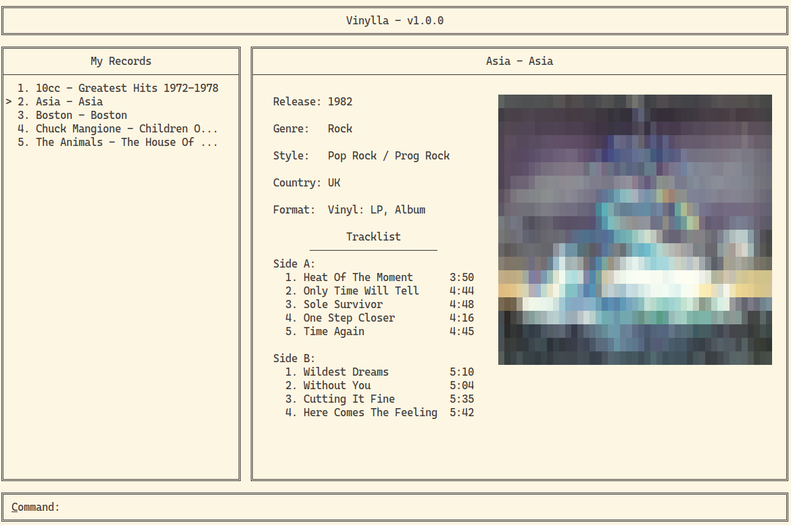

# Vinylla

A terminal application that displays your record collection's info. You'll need a [Discogs](https://www.discogs.com/) account in order to use the application, as it makes use of their developer API to search through their database of records so that you don't have to input all the information manually.

## Usage

The following keys preform the corresponding functions:

* Arrow Keys: Move the record selection cursor up and down
* C: Enters the user into command mode
* Q: Quit the program

The application prevents the user from resizing the terminal, otherwise the application's printing gets all messed up. Do not fullscreen or stick the terminal to a side or the automatic resizing won't work.

## Commands

Login: Authorizes the application with a Discogs account. This is necessary for the application to function. You session is saved when quitting the application by saving the authentication tokens into a file.

Add: Adds a new record to the collection from the record's title and artist name. You need to be logged in for this to work.

Remove: Removes the selected record from your collection.

## Todo

* Properly handle all the .unwrap()s!
* Remove all the magic numbers when moving the cursor
* Allow the application to be resized vertically
* Prompt the user to choose the correct record among the ones given in the search results
* Allow user to select specific release via the release ID
* Implement autofill commands when hitting Tab
* Improve the image to ascii art
* Change AsciiArt to be saved as a string instead of being serialized to take up less space
* Automatically add user's record collection from their discogs account
